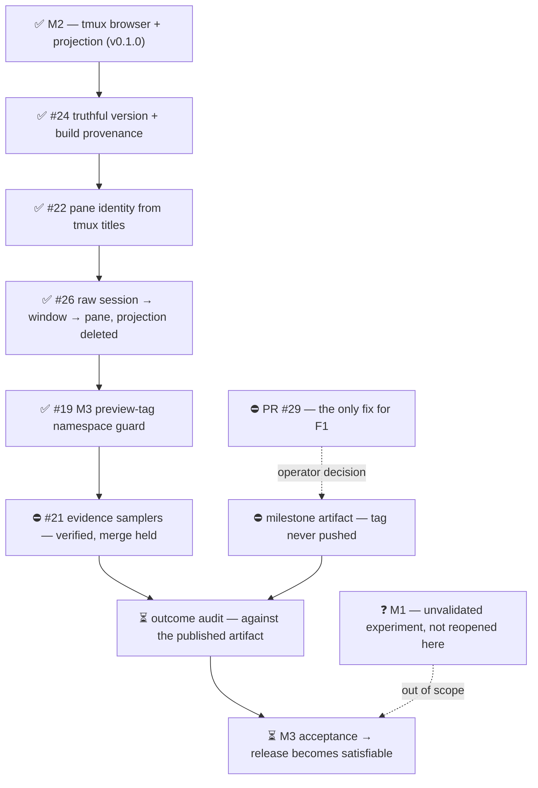

# M3 — No-bugs (release satisfaction)

Outcome: the published factory-tui can be called good enough to release.
The browser does not lie about work in progress.

Updated: 2026-08-14
Legend: ✅ done · 🟡 active/next · ⏳ queued · ⛔ blocked · ❓ unknown

> **⛔ PARKED — OMNIA PAUSA, 2026-08-14T14:59:45Z, operator order via the
> machine owner.** Machine-wide, every session and lane. This is a pause,
> not a teardown: nothing killed, every context survives, every lane
> resumes where it stopped. **Released only by the machine owner, scoped
> and in writing — silence is not release.**

Order only — no bar widths, because none of this work is estimated.

## What was in flight at the pause

| Unit | State | Note |
|---|---|---|
| #21 evidence samplers | ⛔ held | **Verified and complete.** Merge authorization deliberately withheld pending an operator decision — see below |
| milestone artifact | ⛔ blocked | capability built and merged; the tag has never been pushed, blocked on Q-002 |
| #29 release 0.1.1 | ⛔ blocked | the only thing that can make the released build honest |
| outcome audit | ⏳ queued | runs against the published artifact, never a source build |
| M1 | ❓ unknown | unvalidated experiment; deliberately untouched |

Nothing was mid-build or mid-slice at the pause. No candidate abandoned,
no pane torn down, no worktree removed.

## What shipped today

Four tickets merged, every one of them a defect the operator reported
rather than the board found:

- **#24** — the browser can say what it is. It had been reporting `0.0.1`
  from a hardcoded version while claiming to be the `v0.1.0` release.
- **#22** — pane boxes carry real tmux titles instead of `2:claude`.
- **#26** — the projection is deleted; the tree is raw
  session → window → pane with label-only reinterpreters. This ended the
  defect where six windows of one session rendered as three, with the
  rest under a second, identically-titled node.
- **#19** — a milestone-tag namespace guard, proven in both directions.

## The milestone's headline claim, demonstrated

Same session, same moment, shipped build vs #21:

| window | shipped | #21 |
|---|---|---|
| a finished lane at an idle prompt | `RUNNING` | **unmarked** |
| a genuinely working seat | `RUNNING` | `RUNNING` |
| another working seat | `RUNNING` | `RUNNING` |

The first row is the reproduction this milestone opened with. The second
and third are what make it a proof rather than a burn-down: a change that
unmarked everything would look identical and be worthless.

## Blockers, each with what releases it

| Blocker | What unblocks it |
|---|---|
| ⛔ **#21 merge held.** The build exits 2 on the operator's existing configuration — the removed `[status]` table is rejected rather than ignored. The hard failure is judged correct; taking a breaking change is not this desk's call. | an operator ruling on whether to accept the break |
| ⛔ **No installable milestone artifact.** The capability is built, merged and twice verified; zero tags pushed. | a ruling on whether M3 may push its own milestone-scoped tag |
| ⛔ **The released build cannot say what it is.** `v0.1.0` rebuilds to the identical store path as the installed binary, so reinstalling cannot fix it. | merging the prepared release, which is a release act outside M3's hands |
| ❓ Host session names in M1 research pages: the privacy premise says scrub, the M1 ruling says leave M1 alone. | a ruling on which governs |

## Contracts

Eight cross-boundary contracts are recorded. **Three closed today** —
status semantics, published-schema-vs-crate, and shipped-example-vs-crate,
each demonstrated rather than asserted. Five still read `enforced: NONE`
and M3 cannot be accepted while any of them is silent.

Full detail: `.milestones/3/` on the `milestones` branch —
`registry.md`, `fkey-verification-log.md`, `merge-gate.md`.
