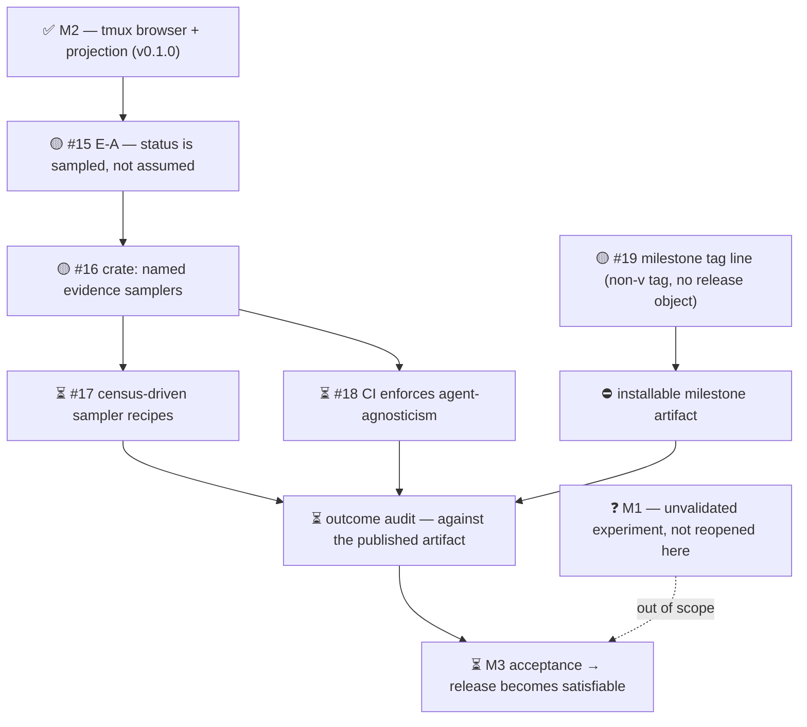

# M3 — No-bugs (release satisfaction)

Outcome: the published factory-tui can be called good enough to release.
The browser does not lie about work in progress.

Updated: 2026-08-13
Legend: ✅ done · 🟡 active/next · ⏳ queued · ⛔ blocked · ❓ unknown

Order only — no bar widths, because none of this work is estimated.

## Where it stands

| Unit | State | Note |
|---|---|---|
| #15 E-A — status samplers | 🟡 active | epic filed and cut into #16 -> #17 -> #18 in that merge order; baseline `just ci` green |
| #19 T-B — milestone tag line | 🟡 active | blocked once on an unsafe publisher; unblocked by A-003 — a non-`v*` tag that triggers no workflow. Baseline green |
| milestone artifact | ⛔ blocked | nothing a stranger can install yet; blocks the outcome audit — not the fixes. Unblocked by T-B |
| outcome audit | ⏳ queued | runs against the published artifact, never a source build |
| M1 | ❓ unknown | unvalidated experiment; deliberately untouched by M3 |

## The defect this milestone is named for

`factory-tui --dump` reports **RUNNING** for any window where a pane's
current command is a configured agent name. That samples *occupancy*,
not *work*.

Reproduced 2026-08-13: window `factory-tui-e8-t5-raw-tree` — a finished
lane sitting at an idle prompt with unsent text — is reported RUNNING.
The same model fails open the other way: a seat running an unlisted
agent is silently unmarked.

A sampler model of *field + regex → status* is the agreed shape, but no
tmux field the crate currently queries separates a thinking agent from a
waiting one. Extending that query is part of the fix, not a later
refinement — otherwise the new model cannot do its job however good the
regexes are.

## Blockers

| Blocker | What unblocks it |
|---|---|
| ⛔ No installable milestone artifact yet — design settled by A-003. A `v*` pre-release tag would fail `check-version-consistency` (tag must equal the `Cargo.toml` version) and yields empty release notes. Both release workflows fire on `v*`, so an unmarked pre-release could take "Latest" from v0.1.0 — worse than none. | T-B: a non-`v*` milestone tag — triggers no publisher, creates no release object, so it cannot become Latest by construction |
| ⛔ Ruling D-2026-08-13-status-samplers is unimplementable as shipped: the census emits only session and window names, so the setup skill cannot pick recipes from the live box. | E-A, skill half |
| ❓ Two rulings collide on host session names in the M1 research pages: scrub them (privacy premise) or leave M1 alone (D-2026-08-13-m1-unvalidated). Escalated as Q-001. | a project-owner ruling |

## Unenforced contracts

Seven cross-boundary contracts are recorded. **Six still read
`enforced: NONE`** — including the one that is actively violated (status
semantics) and the declared-but-unwired `I5-NO-HOSTNAMES` grep, which
exists in the specs and in neither CI nor the Nix checks. The seventh
(milestone artifact) moved to DESIGNED today. Each gets a commissioned
check or a recorded waiver before acceptance — none stays silent.

Full detail: `.milestones/3/registry.md` on the `milestones` branch.
